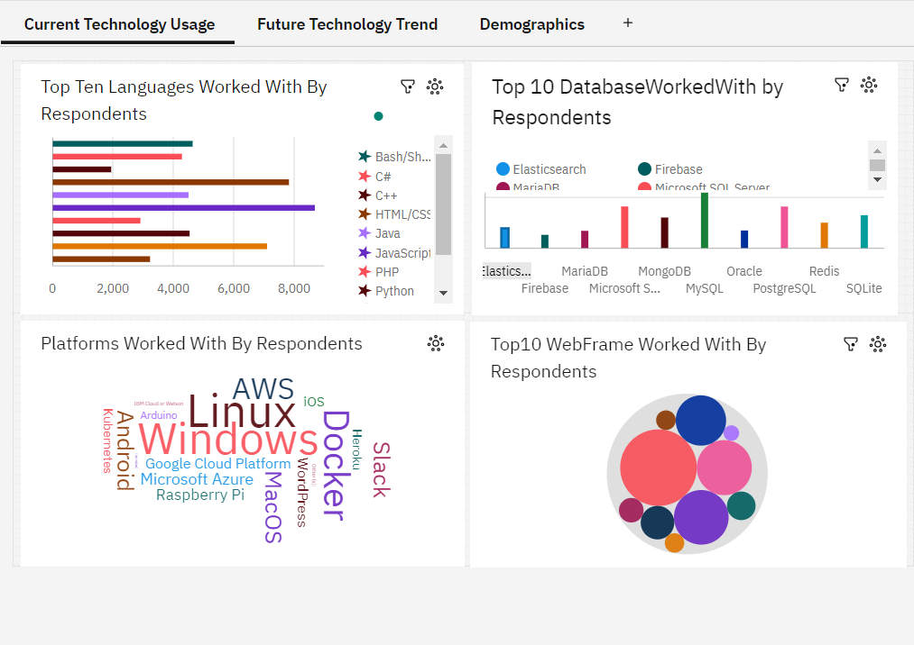
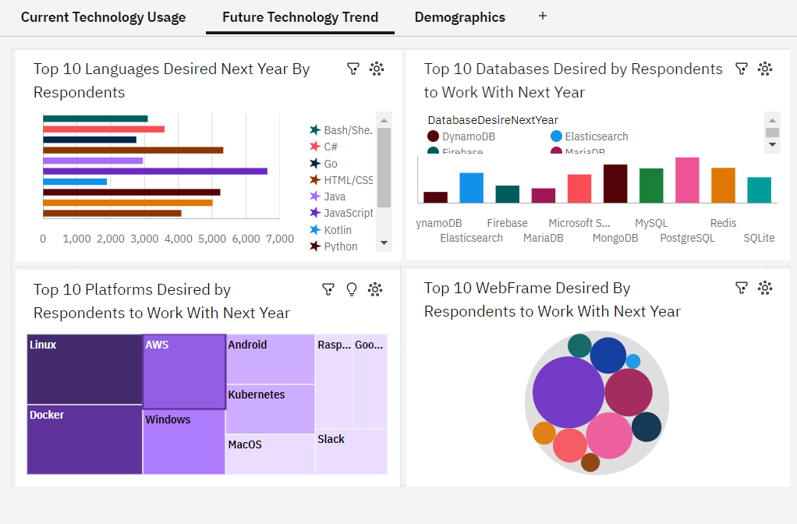
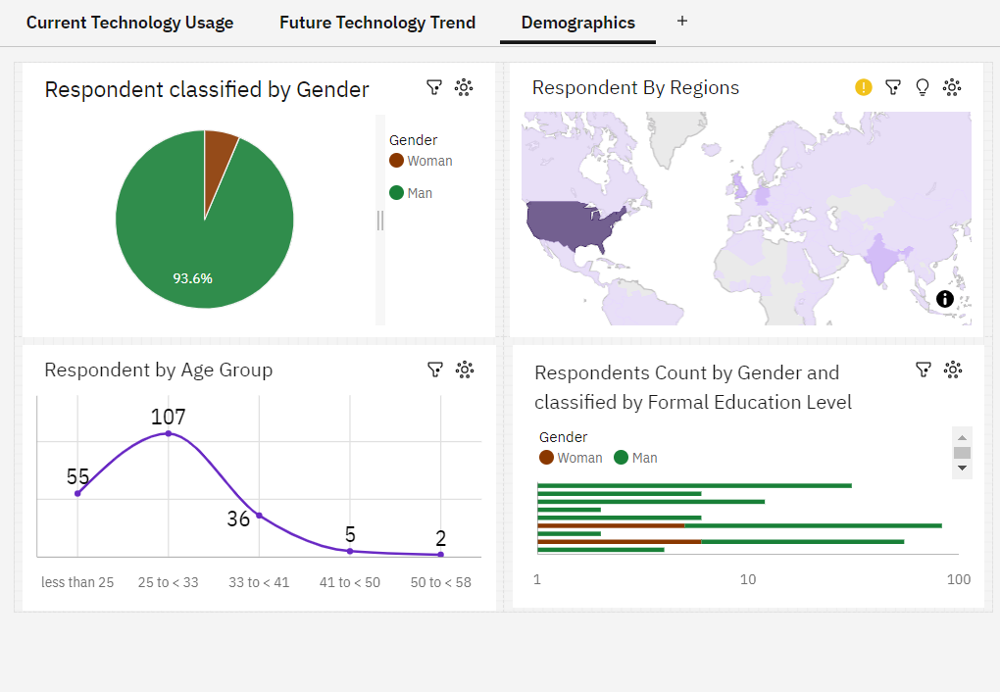

# IBM Data Analytics Capstone Project

A practical data analytics portfolio project covering **data exploration, data wrangling, exploratory analysis, SQL-based analysis, data visualisation, web scraping and IBM Cognos dashboarding**.

The project uses IBM Skills Network survey data and presents the results through Python notebooks, extracted data and a multi-page IBM Cognos dashboard.

## Project at a glance

### What I worked on

- Explored a large developer survey dataset
- Inspected dataset structure, dimensions, and data types
- Identified and removed duplicate records
- Investigated missing values
- Performed data cleaning and compensation normalisation
- Conducted exploratory analysis using Python
- Used SQLite and SQL queries for analysis
- Created charts to examine distributions, relationships, composition, and comparisons
- Scraped programming-language salary information from a web page
- Saved scraped results to CSV
- Built an IBM Cognos dashboard covering current technology usage, future technology preferences, and respondent demographics

## Dashboard

The Cognos dashboard is organised into three main views.

### 1. Current Technology Usage



The dashboard compares the top technologies respondents currently work with, including programming languages, databases, platforms, and web frameworks.

### 2. Future Technology Trend



This view looks at technologies respondents want to work with next year, including programming languages, databases, platforms, and web frameworks.

### 3. Demographics



This view provides demographic context through gender, region, age group, and formal education level.

## Key dashboard findings

### Current programming languages

The dashboard shows JavaScript as the highest-count language in the displayed top 10, with **8,687 respondents**. HTML/CSS follows at **7,830**, and SQL at **7,106**.

### Future programming languages

JavaScript remains the highest-count future language at **6,630 respondents**, followed by HTML/CSS at **5,328**, Python at **5,239**, and SQL at **5,012**.

### Current databases

MySQL has the highest displayed current database count at **5,469**, followed by Microsoft SQL Server at **4,110** and PostgreSQL at **4,097**.

### Future databases

PostgreSQL has the highest displayed future preference at **4,328**, followed by MongoDB at **3,649** and MySQL at **3,281**.

### Demographics

The dashboard shows a respondent split of **93.6% men and 6.4% women**. The largest visible age group is **25 to <33**, with 107 respondents.

These findings describe the respondents represented in the dataset. They should not be interpreted as a population-wide estimate of the technology workforce.

## Analytical workflow

```text
Survey Data
    │
    ├── Data Exploration
    │       └── Structure, dimensions, data types
    │
    ├── Data Wrangling
    │       └── Duplicates, missing values, normalisation
    │
    ├── Exploratory Data Analysis
    │       └── Age, compensation, outliers, correlations
    │
    ├── SQL / Data Visualisation
    │       └── Queries, distributions, relationships, comparisons
    │
    ├── Web Scraping
    │       └── Programming language salary data → CSV
    │
    └── IBM Cognos
            └── Interactive dashboard and visual storytelling
```

## Repository structure

```text
IBM-Data-Analytics-Capstone-GitHub-Ready/
│
├── README.md
├── LICENSE
├── .gitignore
├── requirements.txt
│
├── notebooks/
│   ├── 01_explore_dataset.ipynb
│   ├── 02_data_wrangling.ipynb
│   ├── 03_exploratory_data_analysis.ipynb
│   ├── 04_data_visualization.ipynb
│   └── 05_web_scraping.ipynb
│
├── data/
│   └── popular-languages.csv
│
├── dashboard/
│   ├── dashboard_current_technology.png
│   ├── dashboard_future_technology.png
│   ├── dashboard_demographics.png
│   ├── languages_current.png
│   ├── languages_future.png
│   ├── databases_current.png
│   └── databases_future.png
│
└── docs/
    ├── project_summary.md
    ├── dashboard_insights.md
    └── reproducibility.md
```

## Tools and technologies

**Programming**
- Python
- Pandas
- NumPy

**Data analysis**
- Exploratory Data Analysis
- Data cleaning
- Missing-value handling
- Duplicate detection
- Outlier analysis
- Correlation analysis
- Compensation normalisation

**Visualisation**
- Matplotlib
- Seaborn

**Database**
- SQLite
- SQL

**Web scraping**
- Requests
- BeautifulSoup
- Pandas

**Business intelligence**
- IBM Cognos Analytics

## Skills demonstrated

- Data cleaning and preparation
- Exploratory data analysis
- Data visualisation
- SQL querying
- Dashboard development
- Web scraping
- Data storytelling
- Analytical problem solving
- Translating raw data into business-readable insights

## Data sources

The notebooks reference IBM Skills Network datasets for the survey analysis and a programming-language web page for the web-scraping exercise.

The original notebook code contains the source URLs used for the exercises.

## Reproducibility

The notebooks retain the original analysis workflow and source references. Some notebooks download their datasets directly from IBM Skills Network when executed.

The Cognos dashboard itself is represented here through screenshots because the original Cognos report package was not supplied with the project files.

See `docs/reproducibility.md` for details.

## Project Summary for Portfolio

> **IBM Data Analytics Capstone Project:** Analysed developer survey data using Python, Pandas, SQL and IBM Cognos. Performed data exploration, cleaning, missing-value treatment, compensation normalisation and exploratory analysis, then created visualisations and a multi-page Cognos dashboard covering current technology usage, future technology trends and respondent demographics. Also completed a web-scraping workflow to collect programming-language salary data.

## What this project demonstrates

This project is more than a dashboard. It shows the full analytics workflow from working with raw survey data through cleaning and exploration to visualisation and dashboard presentation.

That makes it suitable as a portfolio project for roles involving **Data Analysis, Business Intelligence, Reporting, Data Visualisation, and entry-level Analytics**.


## Notebook presentation

The notebooks have been cleaned and reorganised for portfolio use. Course branding, lab instructions, author boilerplate and exercise prompts have been removed. Each notebook now follows a consistent structure: objective, setup, analysis, outputs and key takeaway.

See `docs/notebook_guide.md` for a quick explanation of each notebook.
